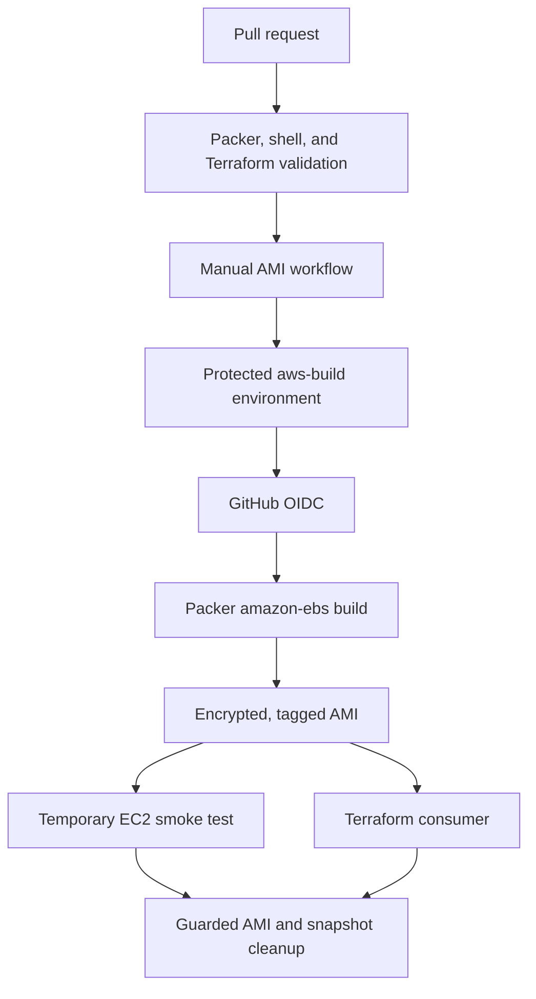
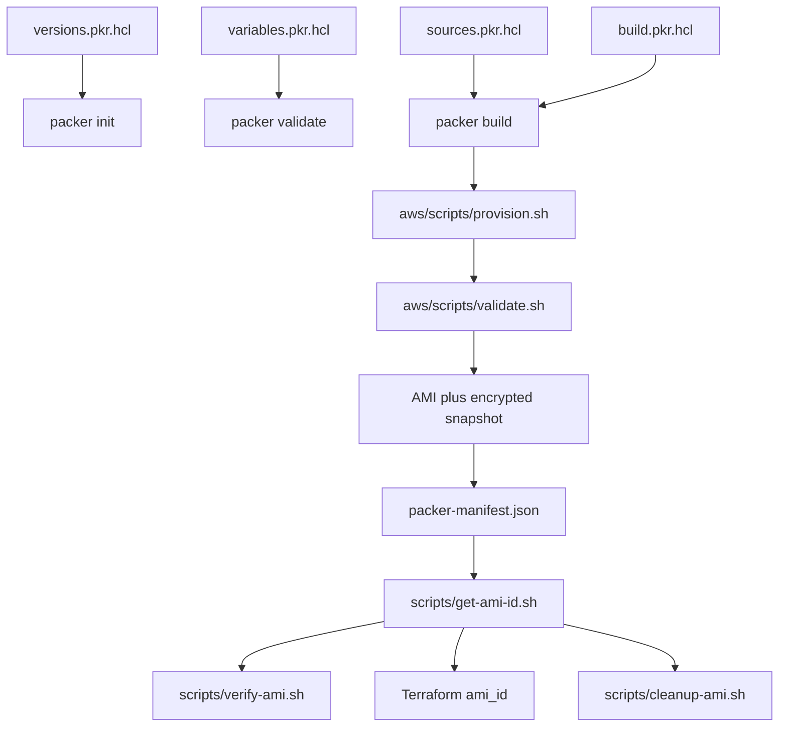

<div align="center">

# Packer AWS Golden Image Pipeline

### Learn image automation by building, testing, publishing, consuming, and cleaning up real artifacts

[](https://github.com/jeevanm84/packer-aws-golden-image-pipeline/actions/workflows/validate.yml)
[](https://developer.hashicorp.com/packer)
[](LICENSE)

[Start the complete guide](docs/END_TO_END_GUIDE.md) · [Architecture](docs/ARCHITECTURE.md) · [Code structure](docs/CODE_STRUCTURE.md) · [Troubleshooting](docs/TROUBLESHOOTING.md) · [Interview questions](docs/INTERVIEW_QUESTIONS.md)

</div>

> [!IMPORTANT]
> Start with [the complete end-to-end guide](docs/END_TO_END_GUIDE.md). It is the canonical path from installing Packer to proving an AWS AMI works and deleting every learning resource safely.

## What you will build

This repository contains three progressive learning tracks:

| Level | Outcome | Cloud cost |
|---|---|---|
| Beginner | Build and verify an Ubuntu-based Docker image with Packer | None beyond local resources |
| Intermediate | Build a tagged, encrypted, IMDSv2-enforced AWS AMI and capture its ID | AWS charges may apply |
| Advanced | Build through GitHub Actions OIDC, smoke-test the AMI, consume it with Terraform, and clean it up | AWS charges may apply |

The complete artifact lifecycle is:



## Why this repository is different

- One ordered guide for beginner, intermediate, and experienced readers.
- No long-lived AWS access keys stored in GitHub.
- Every phase has a visible success checkpoint.
- Cloud creation is manual and approval-friendly—not triggered on every push.
- Verification launches a real instance from the generated AMI.
- Cleanup refuses to delete an AMI without the expected project tag.
- Interview explanations are connected to executable code.

## Quick start: free beginner lab

Prerequisites: Packer, Docker, Git, Bash, and `jq`.

```bash
git clone https://github.com/jeevanm84/packer-aws-golden-image-pipeline.git
cd packer-aws-golden-image-pipeline
packer init beginner/docker
packer validate beginner/docker
packer build beginner/docker
./scripts/test-docker-image.sh
```

Expected final line:

```text
Docker image verification passed for packer-learning-web:latest.
```

No AWS account is required for this beginner lab. AWS workflows are manual-only and require an explicitly configured `aws-build` GitHub environment before they can access a cloud account.

## Verification boundaries

Pull requests validate Packer formatting and configuration, Terraform configuration, and shell syntax without contacting AWS. The free Docker lab exercises a complete local build and runtime test. A real AMI build is deliberately excluded from automatic CI because it creates billable AWS resources; follow the guide's identity, budget, approval, verification, and cleanup checkpoints when you later use a learning account.

## Code structure and change guide

```text
.
├── beginner/docker/
│   ├── docker-ubuntu.pkr.hcl  Zero-cost Docker source, build, and tag
│   └── scripts/provision.sh   Installs and configures nginx
├── aws/
│   ├── versions.pkr.hcl       Packer and Amazon plugin contract
│   ├── variables.pkr.hcl      Typed build inputs and safe defaults
│   ├── sources.pkr.hcl        Ubuntu lookup and amazon-ebs builder
│   ├── build.pkr.hcl          Provision, validate, and emit manifest
│   └── scripts/               In-image provisioning and validation
├── scripts/                   Repository checks, smoke test, ID, cleanup
├── terraform/example-instance Example consumer of the generated AMI ID
├── iam/                       GitHub OIDC trust and learning permissions
├── .github/workflows/         Validate, manually build, and clean up
└── docs/                      Guided learning and technical reference
```

Packer loads all `*.pkr.hcl` files in the selected directory as one template. The AWS files therefore form one pipeline rather than four independent programs:



| Change you want | Start here | Then verify |
|---|---|---|
| Beginner Docker image contents | `beginner/docker/scripts/provision.sh` | `packer build beginner/docker`, then `test-docker-image.sh` |
| AWS base image or temporary builder | `aws/sources.pkr.hcl` | `packer validate ... aws` |
| AMI input or naming behavior | `aws/variables.pkr.hcl` | Example variable file and validation |
| Provisioning or image assertions | `aws/scripts/` and `aws/build.pkr.hcl` | Non-cloud checks before a deliberate AMI build |
| GitHub AWS authentication | `iam/`, `.github/workflows/build-ami.yml` | OIDC subject, environment, account, and region |
| Runtime consumer | `terraform/example-instance/` | `terraform init` and `terraform validate` |
| Verification or deletion safety | `scripts/verify-ami.sh`, `scripts/cleanup-ami.sh` | Shell syntax and project-tag guard |

Read [Code structure](docs/CODE_STRUCTURE.md) for the complete file-by-file map, artifact contracts, and contributor checklist.

## Safety boundaries

- Use a sandbox or learning AWS account with a budget alarm.
- Review all IAM policies with your administrator.
- Run AWS builds only through manual workflow dispatch or deliberate local commands.
- Never commit AWS keys, `.pkrvars.hcl` secrets, state files, or private keys.
- Run cleanup after every practice session.
- This repository is an educational reference, not a drop-in organizational golden-image platform.

## Portfolio roadmap

This repository is the immutable-image stage of the [jeevanm84 engineering portfolio](https://github.com/jeevanm84):

```text
Git foundations → Terraform infrastructure → Packer images
→ Kubernetes platform engineering → MJCart capstone
```

- Foundations: [Git Command Master Map](https://github.com/jeevanm84/git-command-master-map)
- Infrastructure: [Terraform AWS HA Web Platform](https://github.com/jeevanm84/terraform-aws-ha-web-platform)
- Next: [Kubernetes Zero to Production](https://github.com/jeevanm84/kubernetes-zero-to-production)
- Capstone: [MJCart E-commerce Microservices](https://github.com/jeevanm84/mjcart-ecommerce-microservices)

## Contributing

Issues and focused pull requests are welcome. Read [CONTRIBUTING.md](CONTRIBUTING.md), follow the [Code of Conduct](CODE_OF_CONDUCT.md), and report security concerns through [SECURITY.md](SECURITY.md).

Created and maintained by [@jeevanm84](https://github.com/jeevanm84).
