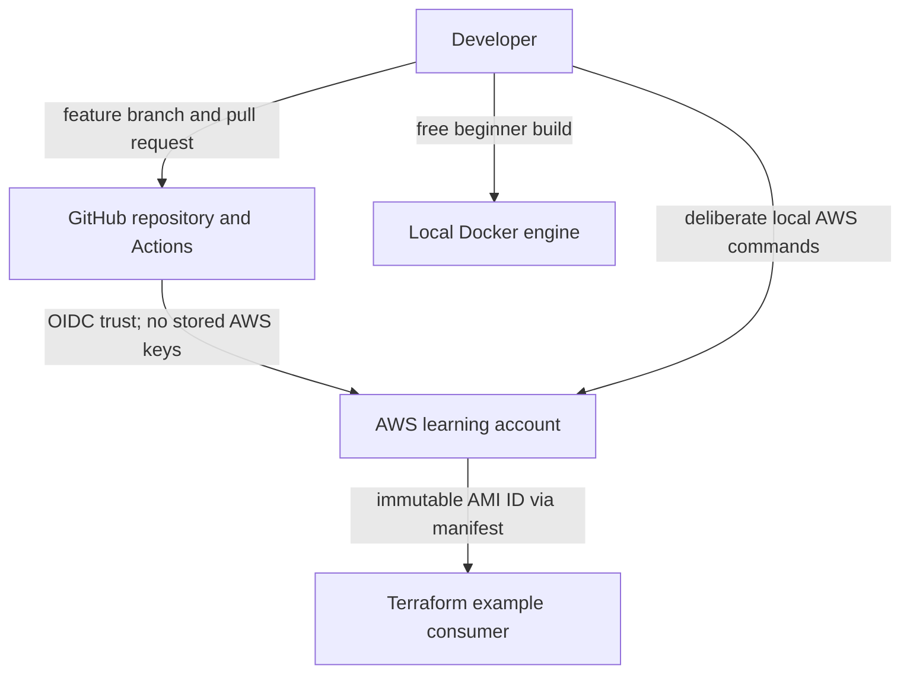
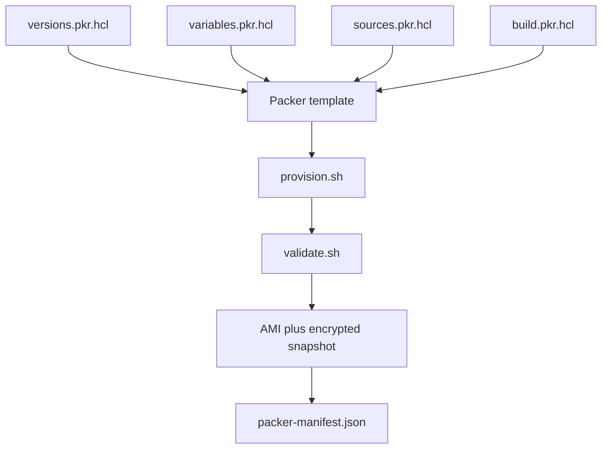
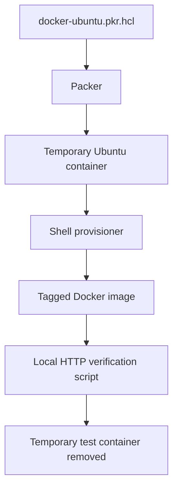
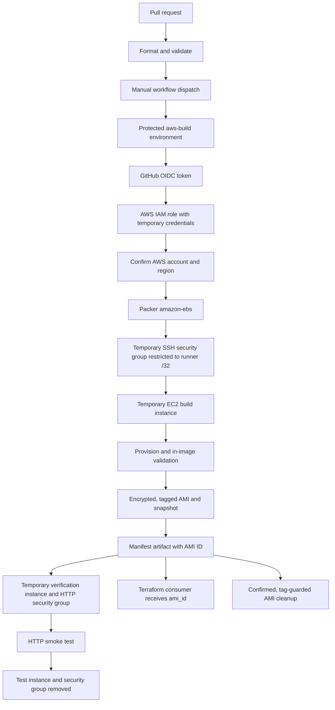
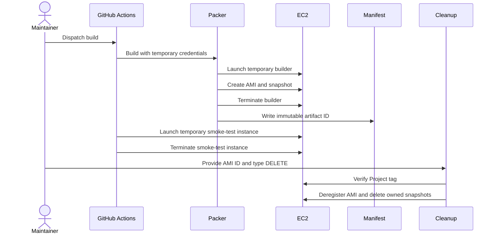

# Architecture

The repository models a complete image lifecycle: define an image as code, validate it without cloud access, build it deliberately, prove the artifact boots, pass its immutable ID to a consumer, and delete every billable learning resource safely.

Use [Code structure](CODE_STRUCTURE.md) for file ownership and [the end-to-end guide](END_TO_END_GUIDE.md) for commands and checkpoints.

## System boundaries

The Docker path is self-contained and free of AWS. The AWS path is inaccessible until a user explicitly configures IAM trust, GitHub environment variables, and a manual workflow dispatch.

## Template assembly

Packer treats all `*.pkr.hcl` files in `aws/` as one configuration. The split documents responsibility for maintainers without changing execution order.

## Local learning path

## AWS build and verification pipeline

The AMI workflow is not connected to `push` or `pull_request`; validating documentation or HCL cannot create cloud resources.

## Artifact contracts

| Producer | Contract | Consumer |
|---|---|---|
| Packer Amazon builder | Tagged AMI and encrypted root snapshot | EC2 and Terraform |
| Manifest post-processor | `packer-manifest.json` with artifact ID, source AMI, and commit | `get-ami-id.sh`, workflow artifact |
| `get-ami-id.sh` | Exact `ami-*` identifier | Smoke test, Terraform variables, cleanup |
| Provisioner | `/etc/packer-image-release` and nginx content | In-image validation and runtime smoke test |
| Terraform example | EC2 instance ID and private IP outputs | Learner verification and cleanup workflow |

Passing an immutable AMI ID avoids a downstream “latest image” search selecting an unintended artifact.

## Resource lifecycle

Build and verification scripts use cleanup behavior for temporary resources. The final AMI and snapshot persist intentionally until the confirmed cleanup workflow runs.

## Security boundaries

- Pull requests can validate code but cannot request AWS credentials.
- AWS access requires `id-token: write`, repository-scoped IAM trust, and the protected `aws-build` environment.
- The trust policy restricts the OIDC subject to `jeevanm84/packer-aws-golden-image-pipeline` and its `aws-build` environment.
- No long-lived AWS key is stored in GitHub.
- The workflow verifies the expected AWS account and uses the configured region.
- Temporary SSH is restricted to the current runner's public `/32` address.
- The build AMI and root snapshot are encrypted and require IMDSv2.
- The cleanup script checks both exact AMI syntax and the project tag before deregistration.
- Workflow-dispatched builds avoid accidental cloud cost on every commit.

## Deliberate learning trade-offs

- The Packer build uses temporary SSH so learners can see the standard communicator flow.
- The learning IAM policy is broad across EC2 because several creation-time operations cannot be scoped to known resource ARNs in advance.
- The HTTP smoke test uses a public test subnet and a `/32` ingress rule that exists only for the test duration.
- The example consumes an AMI directly rather than implementing multi-account promotion and distribution.

The advanced path asks learners to replace these teaching choices with Session Manager, permission boundaries, dedicated build subnets, private networking, provenance policy, image scanning, cross-account distribution, and organizational controls.
