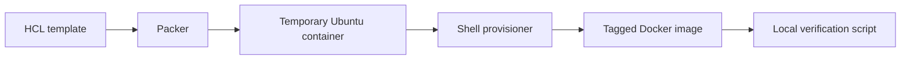
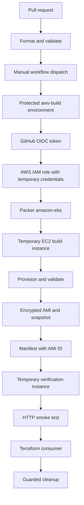

# Architecture

## Local learning path

## AWS pipeline

## Security boundaries

- Pull requests can validate code but cannot request AWS credentials.
- AWS access requires `id-token: write`, repository-scoped IAM trust, and the protected `aws-build` environment.
- No long-lived AWS key is stored in GitHub.
- The build AMI and root snapshot are encrypted.
- The build requires IMDSv2 on temporary and resulting instances.
- The cleanup script checks the exact AMI format and project tag before deregistration.
- Workflow-dispatched builds avoid accidental cloud cost on every commit.

## Deliberate learning trade-offs

- The Packer build uses temporary SSH so learners can see the standard communicator flow.
- The learning IAM policy is broad across EC2 because several creation-time operations cannot be scoped to known resource ARNs in advance.
- The HTTP smoke test uses a public test subnet and a `/32` ingress rule that exists only for the test duration.

The advanced path asks learners to replace these teaching choices with Session Manager, permission boundaries, dedicated build subnets, private networking, and organizational controls.
