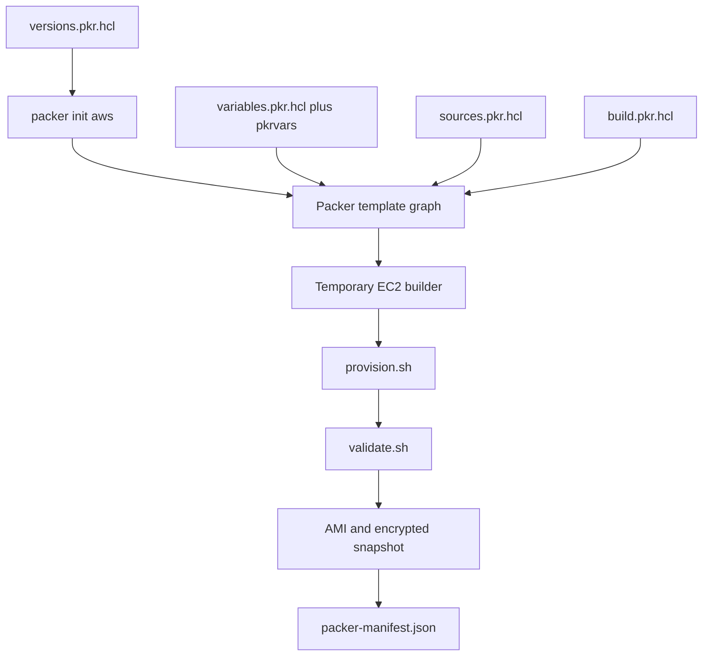
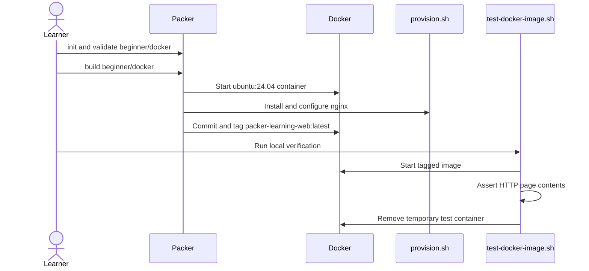
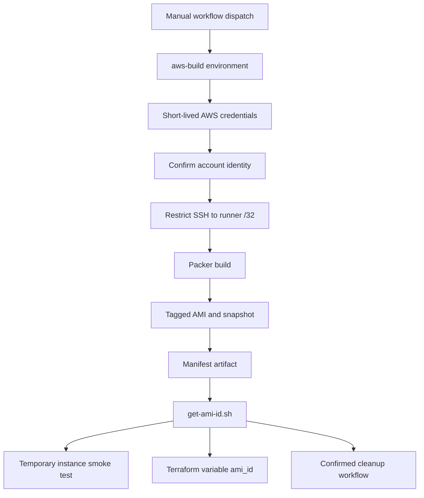

# Code structure

This repository separates image definition, cloud authentication, runtime verification, image consumption, and cleanup so learners can inspect each responsibility independently.

Use [Architecture](ARCHITECTURE.md) for trust boundaries and resource relationships. Use the [complete end-to-end guide](END_TO_END_GUIDE.md) for commands in execution order.

## Repository tree

```text
.
├── beginner/docker/
│   ├── docker-ubuntu.pkr.hcl       Docker plugin, source, build, and tag
│   └── scripts/provision.sh        Installs nginx and writes the test page
├── aws/
│   ├── versions.pkr.hcl            Required Packer and Amazon plugin versions
│   ├── variables.pkr.hcl           Region, image name, source, CIDR, commit
│   ├── sources.pkr.hcl             Ubuntu AMI filter and amazon-ebs settings
│   ├── build.pkr.hcl               Provisioners, validation, manifest output
│   ├── environments/
│   │   └── learning.pkrvars.example.hcl  Safe copy-and-edit input example
│   └── scripts/
│       ├── provision.sh            Configures nginx and image metadata
│       └── validate.sh             Fails the build when image checks fail
├── scripts/
│   ├── check.sh                    All non-cloud repository checks
│   ├── test-docker-image.sh        Local Docker runtime test
│   ├── get-ami-id.sh               Reads the AMI artifact from the manifest
│   ├── verify-ami.sh               Temporary EC2 launch and HTTP smoke test
│   └── cleanup-ami.sh              Tag-guarded AMI and snapshot deletion
├── terraform/example-instance/
│   ├── versions.tf                 Terraform and AWS provider contract
│   ├── variables.tf                AMI, network, region, instance inputs
│   ├── main.tf                     EC2 consumer with encryption and IMDSv2
│   └── outputs.tf                  Instance ID and private address
├── iam/
│   ├── github-oidc-trust-policy.template.json  Repository/environment trust
│   └── packer-permissions-policy.json          Learning build permissions
├── .github/workflows/
│   ├── validate.yml                Pull-request checks; no AWS credentials
│   ├── build-ami.yml               Manual OIDC build and optional smoke test
│   └── cleanup-ami.yml             Manual, confirmed image cleanup
├── docs/                            Guides, architecture, troubleshooting, Q&A
├── Makefile                         Discoverable command shortcuts
└── README.md                        Project entry point and mental model
```

Generated files—local `*.pkrvars.hcl`, `.terraform/`, state, keys, and `packer-manifest.json`—are ignored. The Terraform dependency lock file is intentionally committed.

## How Packer assembles the AWS template

Packer evaluates every `*.pkr.hcl` file in `aws/` together. File names organize responsibilities for humans; the directory is the executable unit.



- `versions.pkr.hcl` controls compatible tooling and plugin installation.
- `variables.pkr.hcl` defines the external contract and rejects invalid names.
- `sources.pkr.hcl` selects the latest official Ubuntu image and defines temporary EC2 and AMI security properties.
- `build.pkr.hcl` establishes provisioner order and the manifest output contract.
- Any non-zero provisioner or validation exit stops image creation.

## Zero-cost Docker path



This path teaches the same source → provision → artifact → runtime-test loop without requiring an AWS account.

## AWS artifact flow



The manifest is the contract between image creation and downstream automation. Scripts read it rather than parsing console output or searching for the newest AMI by name.

## CI and permission boundaries

| Workflow | Trigger | AWS credential permission | Creates resources |
|---|---|---|---|
| `validate.yml` | Pull request and push to `main` | None | No |
| `build-ami.yml` | Manual dispatch | OIDC through `aws-build` | Yes: temporary builder, AMI, snapshot, optional test instance |
| `cleanup-ami.yml` | Manual dispatch plus `DELETE` confirmation | OIDC through `aws-build` | Deletes only a project-tagged AMI and its snapshots |

The protected `main` branch requires the two validation jobs. The build and cleanup workflows are intentionally absent from automatic push triggers.

## Change checklist

1. Work on a feature branch; never place AWS credentials in a file or GitHub secret.
2. Update the file that owns the responsibility instead of combining source, variables, and build logic.
3. Keep the example variable file safe and copyable.
4. Run `make check` or `./scripts/check.sh`; it does not create AWS resources.
5. Update architecture, troubleshooting, and the end-to-end guide when behavior or required setup changes.
6. Open a pull request and wait for both required validation jobs.
7. Use the manual AMI workflow only with an intended learning account and budget controls.
8. Record the manifest artifact, verify the image, and run guarded cleanup after the exercise.
